##Stock App##
This is an app for stock searching ingrading stock details, dynamic history chart and stock news. I also implement saving the favorite stock, facebook share and many other features
####Main Screen####

****************************************
####AutoComplete####
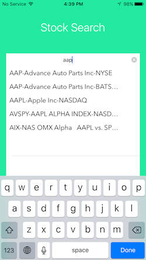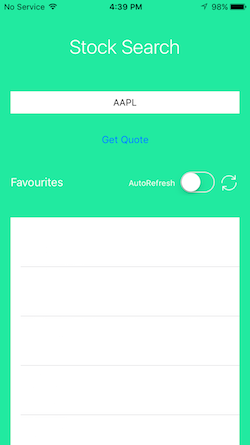

this feature is based on [Markiton](http://markitondemand.github.io). The data includes stock name, stock symbol in most main stock exchanges. When you choose one from autocomplete list, the stock's symbol will be on the text field.

*****************************************
####Stock Detail####
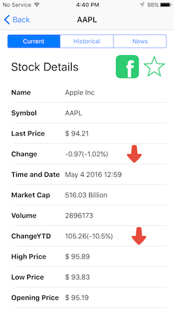

This section includes all the details about the stock

****************************************
####Historic Chart####
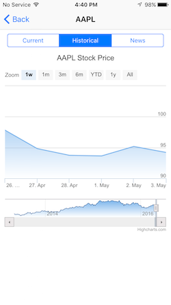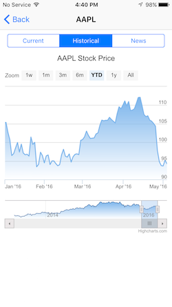

This chart is also based on [Markiton](http://markitondemand.github.io). This chart is based on Webview, so it support all the features on [stock markit search](http://www-scf.usc.edu/~yangpinz/HW8/StockSearch.html).

****************************************
####News####
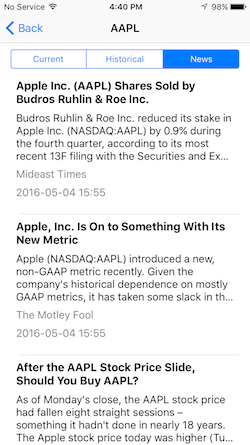

This section provide all the news about the quoted stock. It is based on [Bing News API](https://datamarket.azure.com/dataset/5BA839F1-12CE-4CCE-BF57-A49D98D29A44)

we can tab on each news and jump to browser to see the detailed news

******************************************
####Facebook Share####
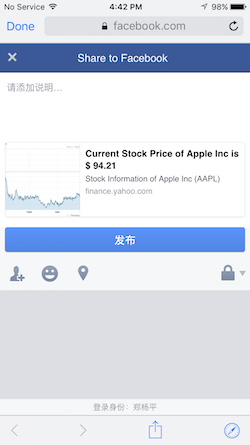

When you tab one facebook button on stock detail section, you are able to post a link to facebook about the stock you a reading. The share title will be the stocks last price. 

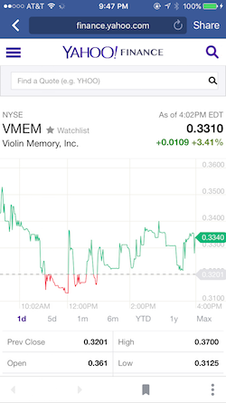

The shared link on facebook is linked to correspond page on [Yahoo Finance](http://finance.yahoo.com)

**************************************
####Like the Stock####
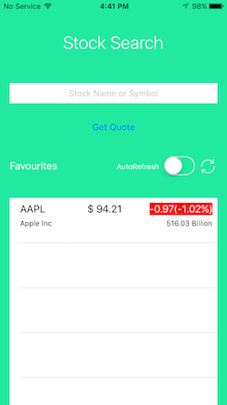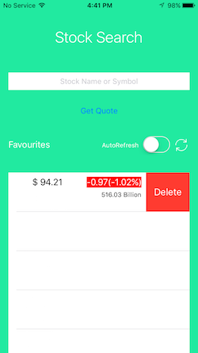

When you tab the star on the head of stock detail section, you are saving the stock to your favorite list. The List is based on Core Data and will save persistly unless you delete them.
But the data on favorte list well be updated.

You can swipe the delete a stock on favorite list

***************************************
####Favorite List####
There are to ways to update the stock information in favorite list.
you can either tab the refresh button or turn on the auto-refresh switch. When you opt on the switch, the list will update the data every 5 sec

*************************************
####Validation####

We validate either empty input or stock symbol with no exact detail information.

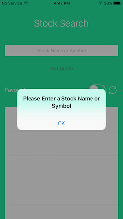
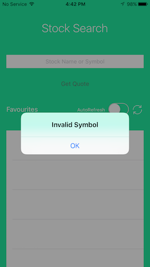

